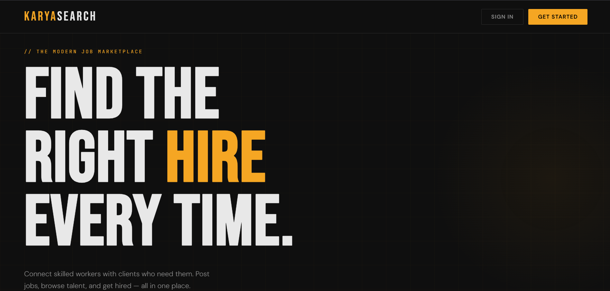
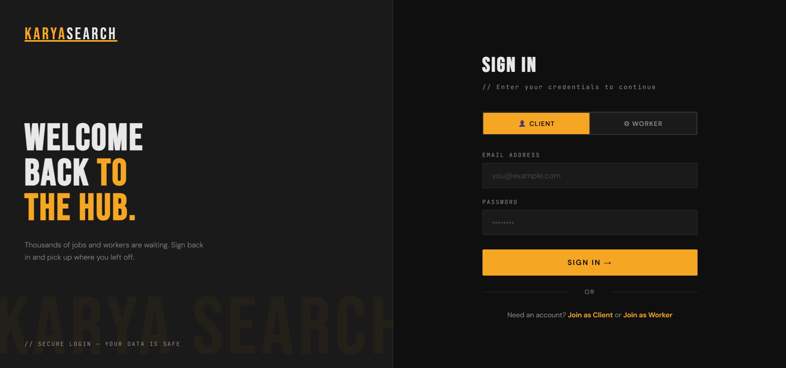
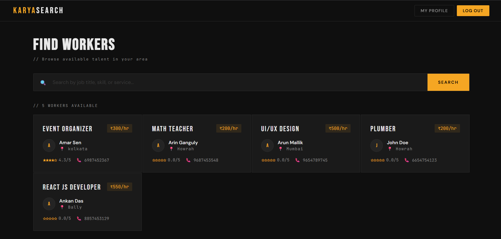
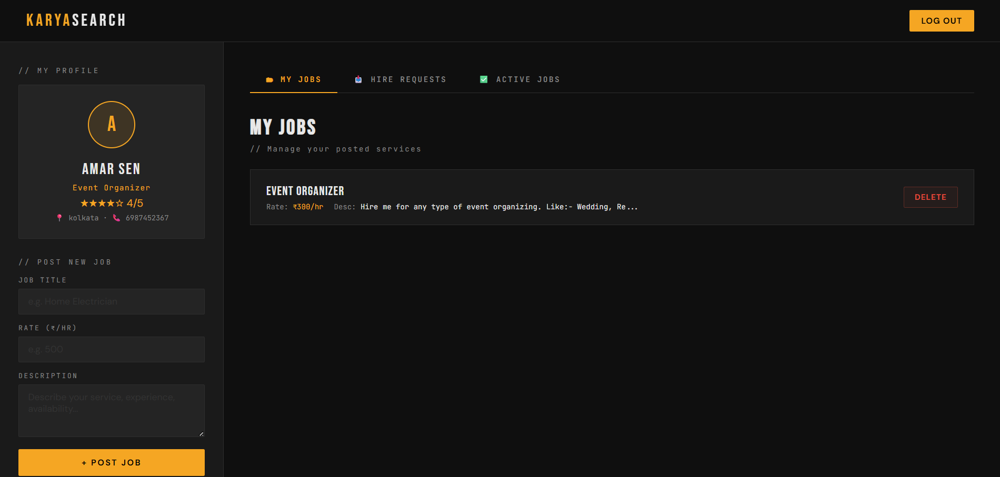
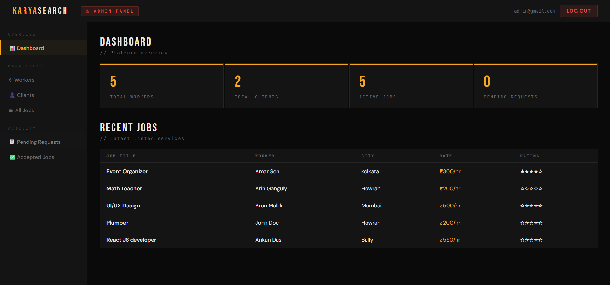

# KaryaSearch

The project was basically a hiring website where local labor offers their services and one can hire them by reviewing their ratings and location etc.

# Live Hosted on Render
link:- https://karyasearch.onrender.com

# Tools & Technologies:
Python, Flask, SQL, HTML, CSS, JSON, and JavaScript

# Screenshots
Folowing are some screenshots showing the design of system.

Landing Page
--
</img>

SignIn Page
--
</img>

Client Page
--
</img>

Worker Page
--
</img>

Admin Page
--
</img>

